# Summary of Advanced SQL Concepts:

### SQL Lesson 1: SELECT queries

In this introductory lesson, we covered the fundamentals of SELECT queries, which form the backbone of SQL data retrieval. Through practical examples, we gained an understanding of how to extract specific data from a single table. By mastering SELECT queries, we've laid a solid foundation for navigating more complex SQL operations.
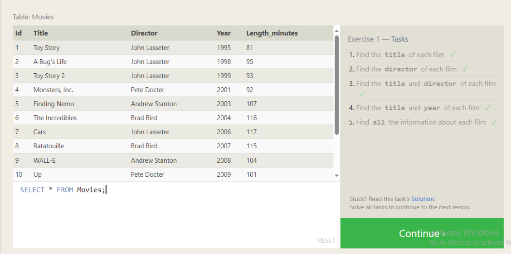

### SQL Lesson 2: Queries with Constraints (Part 1)

In this lesson, we delved into the intricacies of query filtering using the WHERE clause along with a range of comparison operators. By understanding how to apply constraints to our queries, we gained the ability to retrieve precisely the data we need from our database tables, enhancing the efficiency and accuracy of our SQL operations.
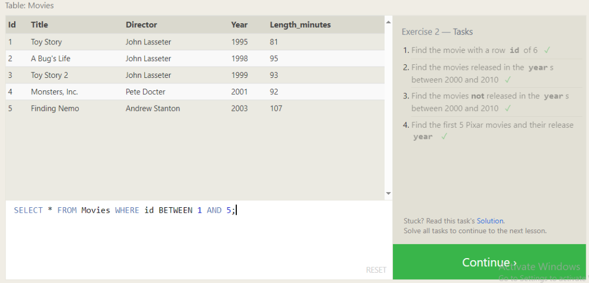

### SQL Lesson 3: Queries with Constraints (Part 2)

Building upon our previous lesson, we delved deeper into filtering query results by exploring complex conditions using operators such as AND, OR, and IN. By mastering these advanced techniques, we gained greater flexibility in refining our queries to extract precisely the data we need from our database tables.
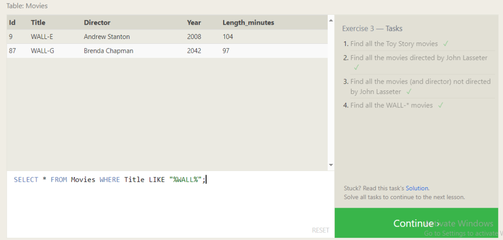

### SQL Lesson 4: Filtering and Sorting Query Results

In this lesson, we expanded our query manipulation skills by learning how to sort query results using the ORDER BY clause. Additionally, we explored the LIMIT clause for efficiently filtering large datasets. These techniques empower us to organize and extract data in a structured manner, enhancing the usability of our SQL queries.
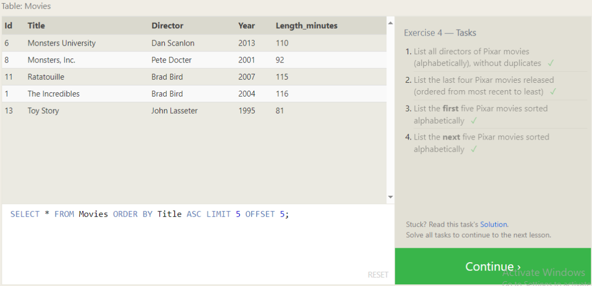

### SQL Review: Simple SELECT Queries

This comprehensive review session allowed us to reinforce our understanding of SELECT queries and practice fundamental SQL commands. By revisiting the basics, we solidified our proficiency in constructing simple yet powerful queries, laying a strong foundation for future SQL endeavors.
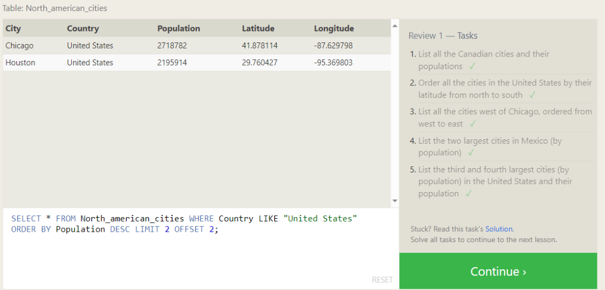

### SQL Lesson 6: Multi-table Queries with JOINs

We embarked on a journey into the realm of multi-table queries by mastering the INNER JOIN operation. By learning how to combine data from multiple tables based on specified criteria, we gained the ability to extract comprehensive insights from interconnected datasets, unlocking new possibilities for data analysis and manipulation.
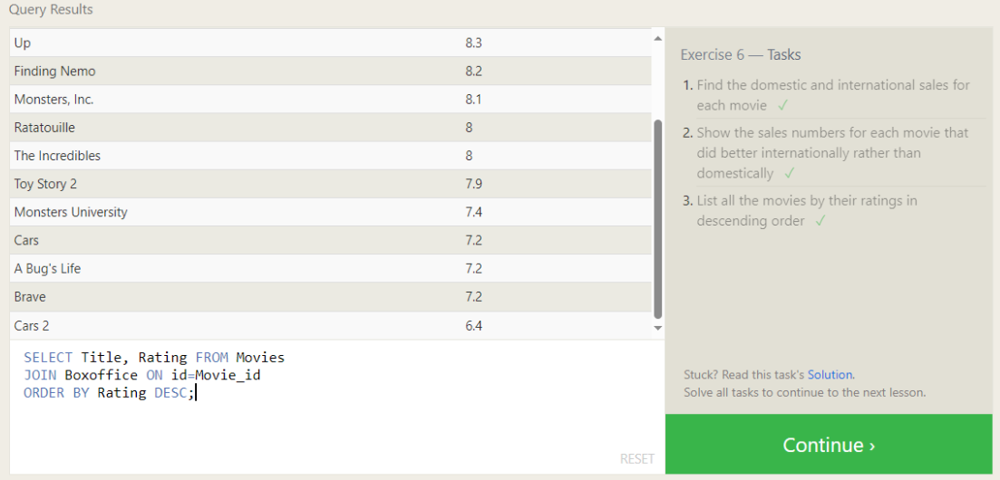

### SQL Lesson 13: Inserting Rows

In this lesson, we acquired the essential skill of inserting rows into database tables using the INSERT statement. By mastering this fundamental operation, we gained the capability to add new data to our databases, facilitating the ongoing growth and evolution of our data repositories.
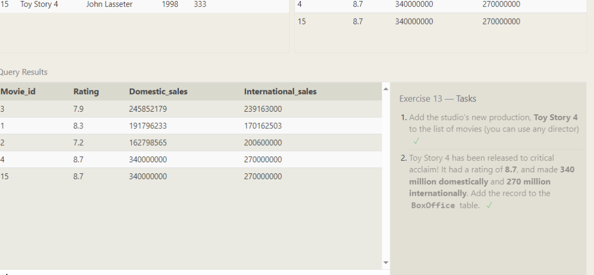

### SQL Lesson 14: Updating Rows
We explored the intricacies of updating existing rows within database tables using the UPDATE statement. By mastering this operation, we gained the ability to modify data dynamically, ensuring the accuracy and relevance of our datasets in response to evolving requirements and conditions.
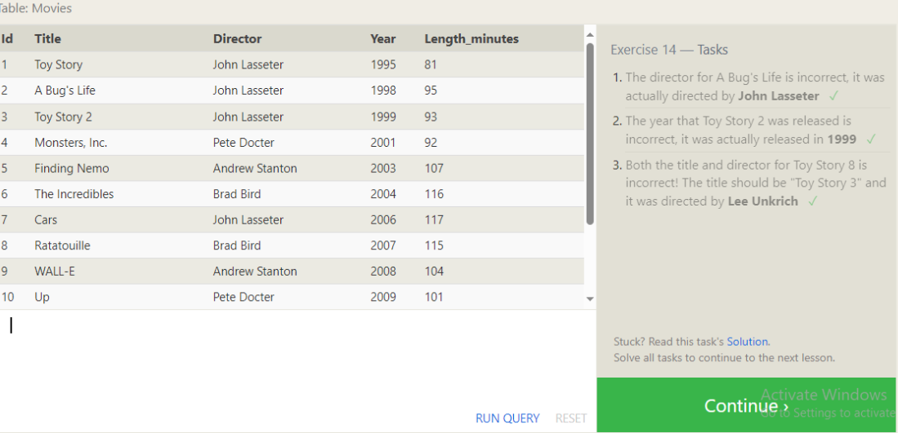

### SQL Lesson 15: Deleting Rows

Delving into the realm of data management, we discussed the process of deleting rows from database tables using the DELETE statement. By understanding this crucial operation, we gained the capability to maintain data integrity and optimize database performance by removing obsolete or redundant records.
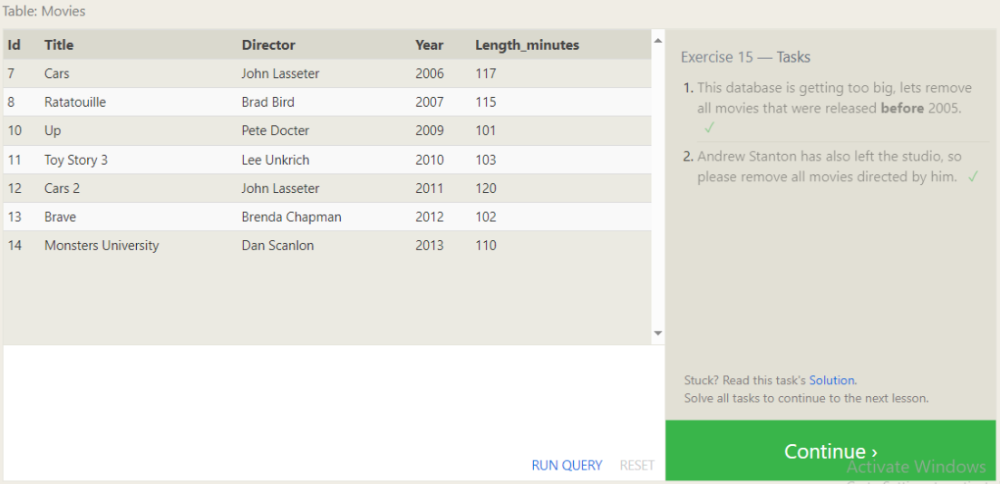

### SQL Lesson 16: Creating Tables

In this lesson, we acquired the foundational knowledge required to create new tables within a database using the CREATE TABLE statement. By mastering this essential skill, we gained the ability to design and implement structured data schemas, laying the groundwork for efficient data organization and management.
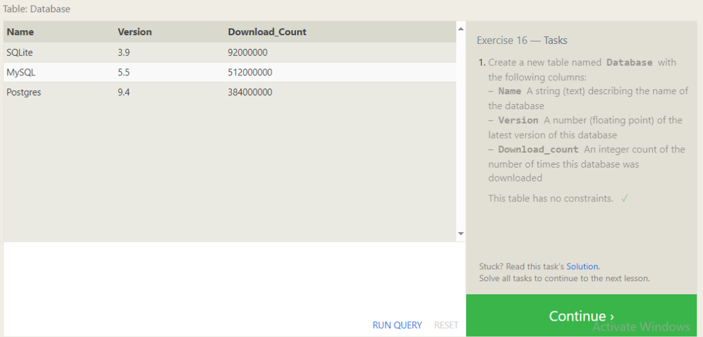

### SQL Lesson 17: Altering Tables

Exploring the dynamic nature of database management, we delved into the process of altering existing tables using the ALTER TABLE statement. By understanding how to modify table structures, we gained the flexibility to adapt our database schemas to evolving requirements, ensuring their continued relevance and effectiveness.
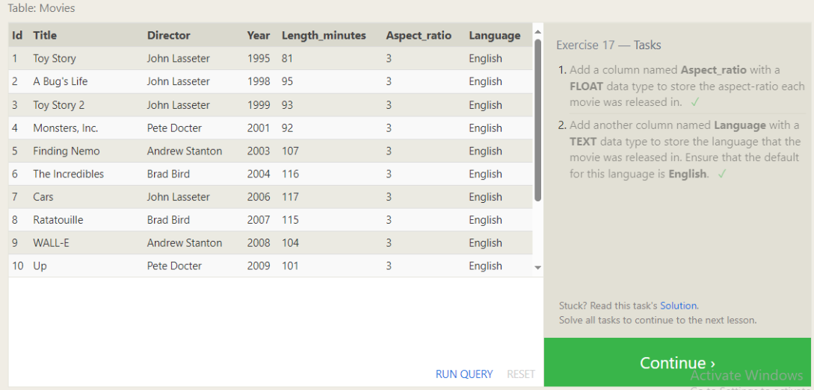

### SQL Lesson 18: Dropping Tables

In our final lesson, we discussed the process of dropping tables from a database using the DROP TABLE statement. By understanding this irreversible operation, we gained insight into database maintenance practices and the importance of careful consideration when removing data structures from our databases.
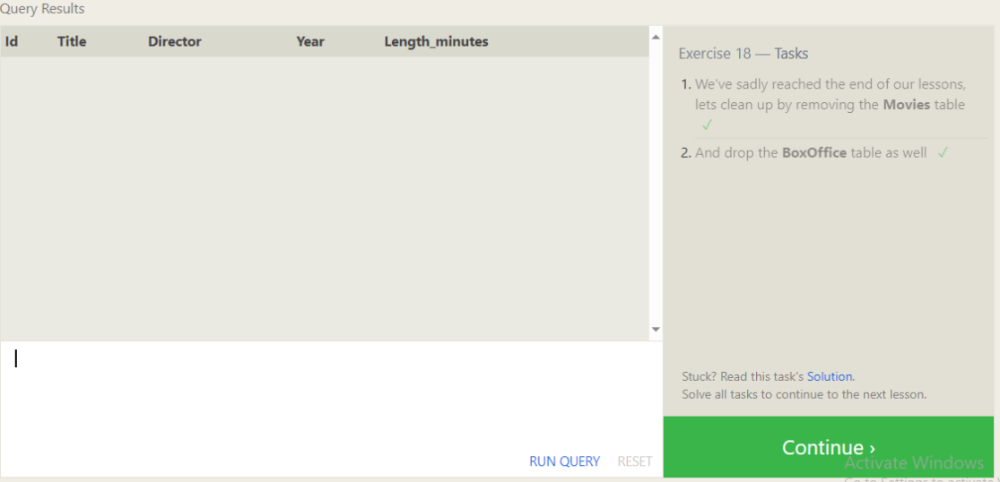

